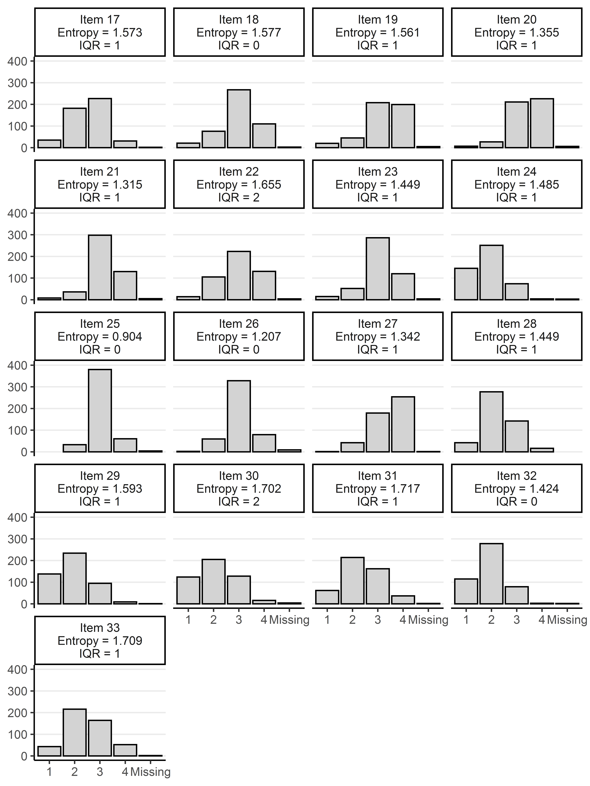
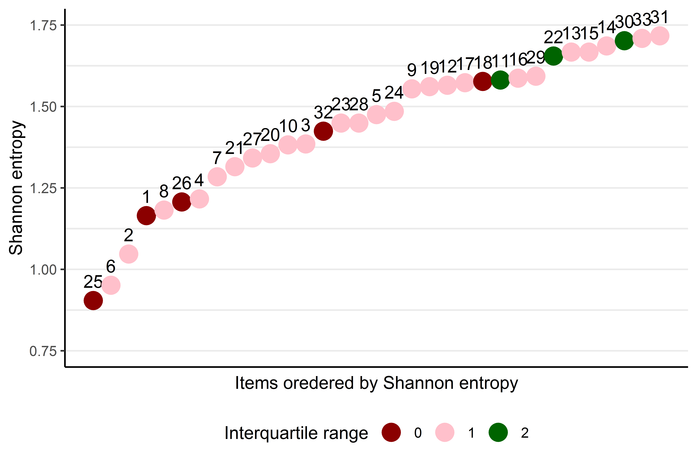
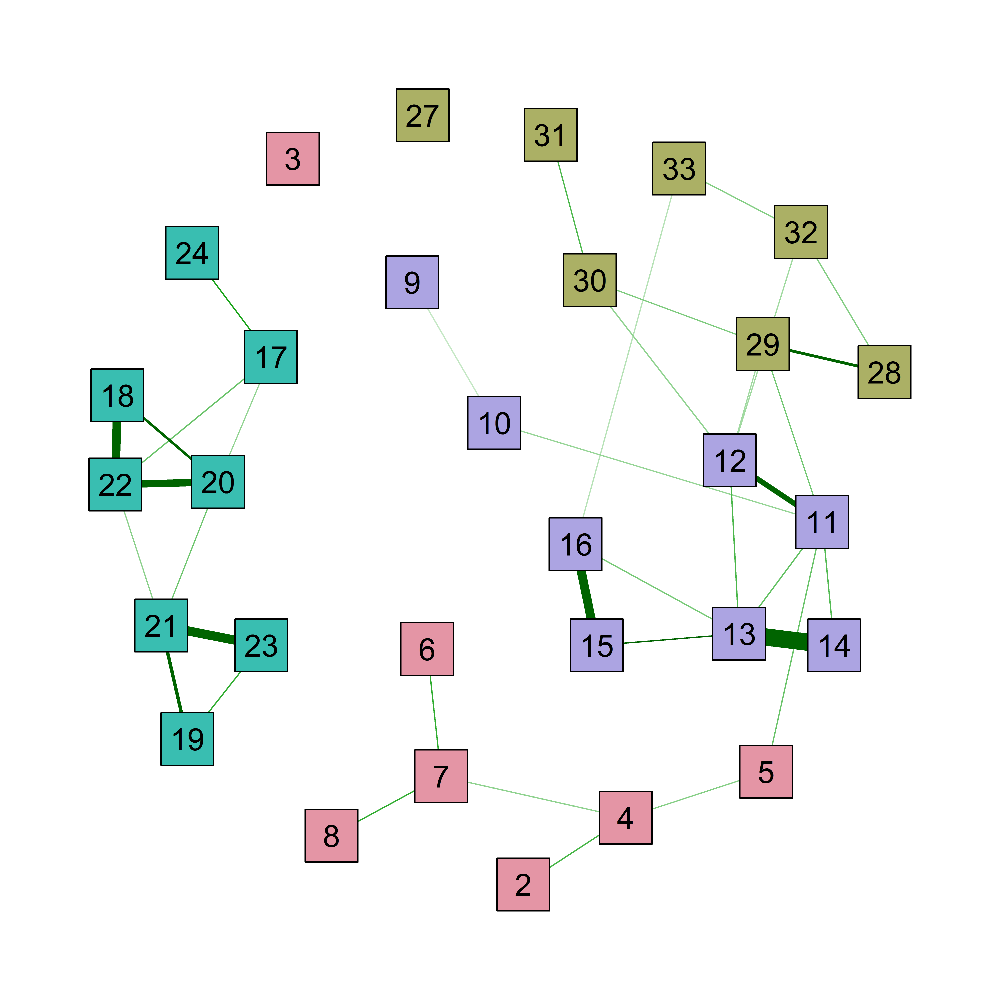

# This repository

This repository contains the code used for analyzing data from a Kalibro-ÚSTR survey, used in the evaluation of project History+.

The folder *code* contains three scripts used in the analysis:

* *0_utils.R* containing a function that converts qgraph plots to ggplots (not used in the analysis). 
* *1_data.R* that is used for data preparation (NB: currently, the data is not a part of this repository, but we are planning to publish it soon)
* *2_network.R* that contains the analysis of the data.
* *3_plots.R* that was used to produce plots for the report stored in the OSF repository.

What follows is a brief presentation of the data and results (more thoroughly described in the full report).

# Sample 

The sample ($N = 477$) contains $130$ males, $346$ females and $1$ unidsclosed gender. Ages reported in the survey range from 21 to 67 ($M = 43.7, SD = 10.44$), with $12$ participants not entering any age and $1$ participant writing "none of your business". Participants come from all $14$ regions of the Czech Republic, with largest groups being from Středočeský kraj, Moravskoslezký kraj and Jihomoravský kraj. Majority ($N = 247$) of the teachers comes from state schools in smaller towns (bellow 100 000 citizens). Most of the teachers have a master's degree ($N = 443$) and a majority of them is teaching at elementary schools ($N = 340$).

# Items

The original analysis plan included the following 33 items, out of which 3 (items 1, 25 and 26) were excluded, due to the lack of variability in recorded responses.

What do you consider to be the main goals of teaching history? 4-point scale **(Completly irrelevant, Slightly irrelevant, Relevant, Highly relevant)**

        1. Teach the pupils facts about Czech and world history
        2. Teach the pupils to find and process information
        3. Teach the pupils to be proud of the Czech republic
        4. Teach the pupils how to build an argument and participate in a discussion
        5. Introduce the pupils to the methods of historical inquiry
        6. Help the pupils to understand the contemporary world
        7. Present the pupils with the relativity of evaluating historical events
        8. Guide the pupils to have a positive attitudes towards historical knowledge
        
What materials do you use in teaching history and how often? 5-point scale **(Never, Rarely, Once a semester, Once a week, Almost every lesson)**

        9. Textbooks
        10. History maps
        11. History literature (fact)
        12. History literature (fiction)
        13. Historical documents (charters, legislation, correspondence...)
        14. Historical press
        15. Historical photography
        16. Historical films

We would like to know how you generally feel about your job. How strongly do you agree or disagree with the following statements? (TALIS) **4-point scale (Strongly disagree, Disagree, Agree, Strongly agree)**

        17. The advantages of being a teacher clearly outweigh the disadvantages
        18. If I could decide again, I would still choose to work as a teacher
        19. (-) I would like to change to another school if that were possible
        20. (-) I regret that I decided to become a teacher
        21. I enjoy working at this school
        22. (-) I wonder whether it would have been better to choose another profession
        23. I would recommend this school as a good place to work
        24. I think that the teaching profession is valued in society
        25. I am satisfied with my performance in this school
        26. All in all, I am satisfied with my job
        
Thinking about your teaching in the, how often do you do the following? (TALIS) **4-point scale (Never or almost never, Occasionally, Frequently, In all or nearly all lessons)**

        27. I present a summary of recently learned content
        28. Students work in small groups to come up with a joint solution to a problem or task
        29. I give different work to the students who have difficulties learning and/or to those who can advance faster
        30. I let students practice similar tasks until I know that every student has understood the subject matter
        31. I check my students’ exercise books or homework
        32. Students work on projects that require at least one week to complete\newline
        33. Students use ICT (information and communication technology) for projects or class work 

# Analysis

We use EBICglasso regularization to estimate partial correlation network on a Spearman correlation matrix and use 1000 bootstraps to assess the network accuracy:

```r
net_0 <- estimateNetwork(data = data_network_use %>%
                           mutate_all(as.numeric) %>%
                           `names<-`(as.character(1:ncol(.))),
                         missing = "pairwise",
                         corMethod = "spearman",
                         default = "EBICglasso")

set.seed(108)

bootstraps <- bootnet(net_0, 
                 nBoots = 1000,
                 type = "nonparametric",
                 nCores = parallel::detectCores())
```

# Plots
## Sample


## Items




## Network




## Parameter estimates


